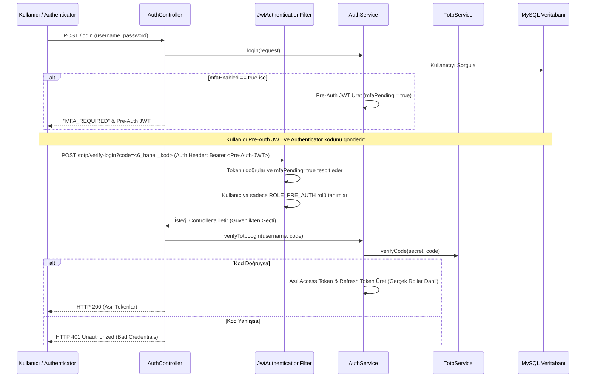

# 🛡️ Employee Management & Spring Security JWT API (2fa-google-authenticator Branch)

Bu branch, projemize zamana dayalı tek kullanımlık şifreler (TOTP - Time-Based One-Time Password) kullanarak **Google Authenticator veya Microsoft Authenticator** gibi uygulamalarla entegre **İki Aşamalı Doğrulama (2FA)** özelliğini ekler.

Bu sürümde, kullanıcının hesabı şifresine ek olarak 30 saniyede bir yenilenen 6 haneli doğrulama kodlarıyla en yüksek seviyede korunmaktadır.

---

## 📌 Bu Branch'in Amacı ve Mantığı

Geleneksel e-posta OTP doğrulamasından farklı olarak, TOTP internet bağlantısı gerektirmeyen, zamana dayalı algoritmalarla (RFC 6238) çalışan cihaz üstü bir güvenlik katmanıdır. Entegrasyon ve çalışma mantığı şu şekildedir:

### 1. Kurulum ve Aktifleştirme Süreci (2FA Setup)
1. **QR Kod Üretimi (`/totp/setup`)**: Giriş yapmış olan bir kullanıcı, 2FA özelliğini aktifleştirmek için bu talebi gönderir. Sunucu, `dev.samstevens.totp` kütüphanesini kullanarak benzersiz bir `totpSecret` (gizli anahtar) üretir ve kullanıcının Authenticator uygulamasına taratabilmesi için Base64 formatında bir QR Kod görseli üretip döner.
2. **2FA'yı Aktif Etme (`/totp/enable`)**: Kullanıcı uygulamaya eklediği hesaptan ürettiği ilk 6 haneli kodu sunucuya gönderir. Kod doğrulanırsa `mfaEnabled` alanı `true` yapılır.

### 2. Giriş Aşamaları (Two-Step Login Flow)
1. **Adım 1: Kullanıcı Girişi (`/login`)**:
   Kullanıcı adı ve şifre kontrol edilir. Eğer kullanıcının `mfaEnabled = true` ise, sunucu doğrudan sisteme erişim veren Access Token'ı **dönmez**. Bunun yerine, claim alanında `mfaPending = true` bilgisi yer alan kısa ömürlü bir **Pre-Auth JWT** üretir ve yanıt olarak `"MFA_REQUIRED"` mesajı verir.
2. **Güvenlik Filtresi Sınırlandırması (`ROLE_PRE_AUTH`)**:
   `JwtAuthenticationFilter`, gelen token'da `mfaPending = true` flag'ini görürse kullanıcının gerçek rollerini (`USER`/`ADMIN`) geçici olarak maskeler ve ona sadece **`ROLE_PRE_AUTH`** yetkisini atar. `SecurityConfig.java` yapılandırması gereği, bu yetkiye sahip kullanıcılar sadece `/totp/verify-login` endpoint'ine erişebilir; diğer tüm korumalı API'lere erişimleri engellenir.
3. **Adım 2: TOTP Kodu Doğrulama (`/totp/verify-login`)**:
   Kullanıcı, Pre-Auth JWT'sini header'da (Bearer) göndererek ve Authenticator uygulamasındaki güncel 6 haneli kodu sunarak bu endpoint'i tetikler. Kod doğrulanırsa, kullanıcının gerçek rollerini barındıran asıl **Access Token** ve **Refresh Token** oluşturularak giriş başarıyla tamamlanır.

---

## 🛠️ Bu Branch'te Yapılanlar & Teknik Mimari

### 1. Yeni Eklenen Sınıflar ve Yapılar
*   **`TotpService`**: `dev.samstevens.totp` tabanlı secret generator, QR generator (ZxingPngQrGenerator) ve kod doğrulama (isValidCode) bileşenlerini barındıran ana servis sınıfıdır.
*   **`TotpSetupResponse` (DTO)**: Üretilen gizli anahtarı (secret) ve Base64 formatındaki QR kod görselini istemciye taşır.
*   **`Employee` Sınıfı Güncellemeleri**:
    *   `totpSecret` (String): Kullanıcıya özel üretilen gizli TOTP anahtarı.
    *   `mfaEnabled` (boolean): İki aşamalı doğrulamanın aktif olup olmadığı flag'i.
*   **`JwtAuthenticationFilter` Sınırlandırması**: Token doğrulama aşamasında `jwtUtil.isMfaPending(jwt)` kontrolüyle kullanıcıyı `ROLE_PRE_AUTH` rolüne atar.

### 2. Akış Diyagramı (TOTP Login Flow)

---

## 🗺️ API Uç Noktaları (Endpoints)

### TOTP 2FA Yönetim Endpoint'leri

*   **POST** `/api/v1/auth/totp/setup`
    *   **Açıklama:** Google Authenticator kurulumu için QR Kod ve Secret üretir. (Giriş yapmış olmak gerekir).
    *   **Yanıt Gövdesi:** `TotpSetupResponse` `{ "secret": "ABCD1234...", "qrCodeImage": "data:image/png;base64,..." }`
*   **POST** `/api/v1/auth/totp/enable?code={code}`
    *   **Açıklama:** QR kodu tarattıktan sonra gelen ilk kodu doğrulayarak kullanıcının 2FA özelliğini tamamen aktif eder.
*   **POST** `/api/v1/auth/totp/verify-login?code={code}`
    *   **Açıklama:** `/login` aşamasından sonra elde edilen Pre-Auth JWT ile çağrılır. 6 haneli TOTP kodunu doğrular ve asıl giriş token'larını döndürür. (Sadece `ROLE_PRE_AUTH` yetkisiyle erişilebilir).
