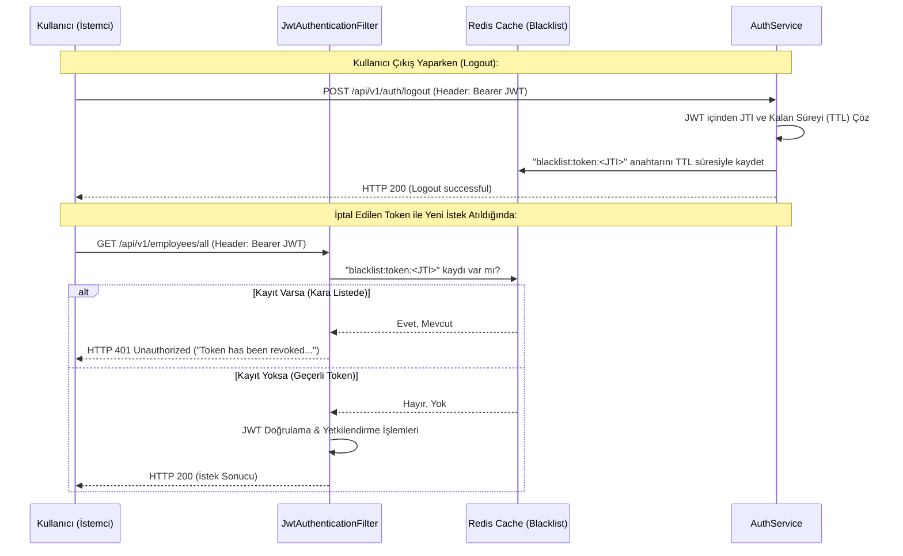

# 🛡️ Employee Management & Spring Security JWT API (token-blacklist Branch)

Bu branch, projemize JWT (JSON Web Token) tabanlı oturumların güvenle kapatılmasını ve çalınan/eski token'ların anında geçersiz kılınmasını sağlayan **Token Kara Liste (Token Blacklisting / Revocation)** mekanizmasını ekler.

Bu sürümde, durumsuz (stateless) JWT yapısının en büyük dezavantajı olan "token süresi dolana kadar iptal edilememe" sorunu, **Redis** entegrasyonu kullanılarak tamamen çözülmüştür. Önceki tüm güvenlik özellikleri (2FA, OAuth2, Rate Limiting vb.) bu branch'te mevcuttur.

---

## 📌 Bu Branch'in Amacı ve Mantığı

Normal şartlarda stateless JWT'ler sunucuda saklanmadığı için, bir kullanıcı oturumu kapattığında dahi elindeki JWT'nin süresi bitene kadar o JWT ile istek yapmaya devam edebilir. Bu güvenlik açığını kapatmak amacıyla **Token Blacklisting** yaklaşımı uygulanmıştır:

### 1. Oturum Kapatma ve İptal Süreci (`/logout`)
1. Kullanıcı `/logout` isteği gönderdiğinde, isteğin `Authorization` başlığındaki aktif JWT token'ı çözümlenir.
2. Token'ın içerisindeki benzersiz kimlik bilgisi olan **JTI (JWT ID)** değeri çıkartılır.
3. Token'ın kalan son geçerlilik süresi milisaniye cinsinden hesaplanır (`getRemainingValidityExpirationMillis`).
4. Bu token, **Redis** veritabanına `blacklist:token:<JTI>` anahtarı ile eklenir. Anahtarın yaşam süresi (TTL), token'ın kalan geçerlilik süresine eşit olarak ayarlanır. Böylece token'ın orijinal süresi dolduğunda Redis bu kaydı bellekten otomatik olarak temizler.
5. Kullanıcının veritabanındaki ilişkili `RefreshToken` kaydı da silinerek yeni Access Token alması kalıcı olarak engellenir.

### 2. İstek Doğrulama Aşamasında Kara Liste Denetimi (`JwtAuthenticationFilter`)
1. API'ye gelen her korumalı istekte, JWT doğrulanmadan önce **Redis** üzerinde kara listede olup olmadığı kontrol edilir (`tokenBlacklistService.isBlacklisted(jwt)`).
2. Eğer token kara listedeyse filtre zinciri sonlandırılır, HTTP 401 Unauthorized durum kodu ve bir hata mesajı dönülür.
3. Token kara listede değilse normal JWT imza kontrolü, süre denetimi ve yetkilendirme aşamalarına geçilir.

---

## 🛠️ Bu Branch'te Yapılanlar & Teknik Mimari

### 1. Yeni Eklenen ve Güncellenen Sınıflar
*   **`TokenBlacklistService`**: Redis (`StringRedisTemplate`) entegrasyonunu yöneten servistir.
    *   `blacklistToken(jwt, remainingValidity)`: Token'ı kalan süresiyle Redis'e kaydeder.
    *   `isBlacklisted(jwt)`: Token'ın JTI değerine göre Redis'te kaydının olup olmadığını denetler.
*   **`JwtAuthenticationFilter`**: Gelen JWT'nin öncelikle kara listede olup olmadığını sorgular. Kara listedeki token'lar için anında HTTP 401 döner.
*   **`AuthService` & `AuthController`**:
    *   `/logout` endpoint'i isteğin header'ından JWT'yi okuyarak `AuthService.logout(jwt)` metoduna iletir ve token'ı kara listeye aldırır.

### 2. Kara Liste Akış Diyagramı (Token Revocation Flow)


---

## 🔑 İptal Edilen Token Hata Yanıt Şablonu (HTTP 401)

Kara listeye alınmış bir token ile istek atıldığında dönen yanıt:
```json
{
  "message": "Token has been revoked. Please login again."
}
```

---

## ⚙️ Kurulum ve Redis Yapılandırması (`application.properties`)

Token Blacklist özelliğinin çalışması için Redis sunucusunun devrede olması gerekir.

`application.properties` yapılandırması:
```properties
# Redis Configuration
spring.data.redis.host=localhost
spring.data.redis.port=6379
```
