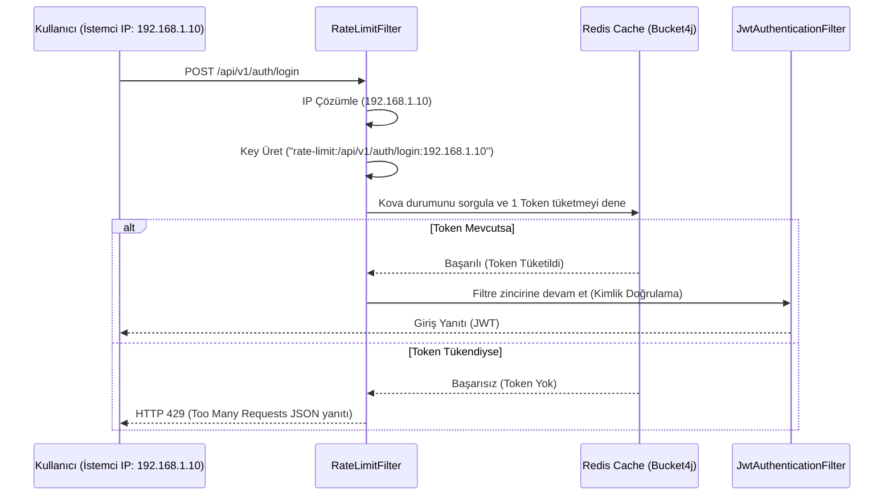

# 🛡️ Employee Management & Spring Security JWT API (rate-limiting Branch)

Bu branch, projemize dağıtık (distributed) ve yüksek performanslı bir **İstek Sınırlandırma (API Rate Limiting)** mekanizması ekler. Amacı, sisteme yapılacak kaba kuvvet (brute-force) saldırılarını, DDoS girişimlerini ve aşırı kaynak tüketimini engelleyerek API uç noktalarını korumaktır.

Bu sürüm, **Redis** ve **Bucket4j** kütüphaneleri entegrasyonu ile oluşturulmuştur. Önceki tüm güvenlik, doğrulama (2FA) ve sosyal giriş özellikleri de bu branch içerisinde yer almaktadır.

---

## 📌 Bu Branch'in Amacı ve Mantığı

Sistemdeki kritik endpoint'lerin (örneğin login, şifre sıfırlama, OTP doğrulama) kötü niyetli kişilerce suistimal edilmesini önlemek amacıyla, istemcilerin belirli zaman aralıklarında yapabilecekleri maksimum istek sayısı sınırlandırılmıştır. 

### Çalışma Mantığı:
1. **İstek Yakalama (`RateLimitFilter`)**: Gelen tüm HTTP istekleri filtre zincirinin en başında yakalanır.
2. **Kural Eşleştirme**: İstek yapılan path (`request.getRequestURI()`), `RateLimitRulesConfig` içinde tanımlanan kurallarla (`AntPathMatcher` kullanılarak) karşılaştırılır. Eğer eşleşen bir kural varsa rate limit kuralları uygulanır, yoksa filtre zincirine doğrudan devam edilir.
3. **IP ve Key Üretimi**: İstemcinin IP adresi, proxy'lerin arkasından dahi doğru tespit edilebilmesi için önce `X-Forwarded-For` başlığından, bulunamazsa `request.getRemoteAddr()` üzerinden çözümlenir. Endpoint deseni ile IP birleştirilerek Redis için benzersiz bir anahtar (`rate-limit:<pathPattern>:<clientIp>`) üretilir.
4. **Redis Destekli Bucket4j (Distributed Token Bucket)**:
   * Dağıtık mimariyi desteklemek amacıyla token kova (bucket) durumları yerel RAM yerine **Redis** üzerinde tutulur (Lettuce CAS Proxy Manager aracılığıyla).
   * Her istek geldiğinde Redis'teki ilgili kovadan 1 token düşürülmeye çalışılır.
   * Kova boşsa (token kalmadıysa) istek engellenir ve HTTP 429 yanıtı dönülür. Kova zamanla otomatik olarak dolmaya (refill) devam eder.

---

## 🛠️ Bu Branch'te Yapılanlar & Teknik Mimari

### 1. Yeni Eklenen ve Güncellenen Sınıflar
*   **`RateLimitRule`**: Bir endpoint deseni (`pathPattern`), o desene ait maksimum kova kapasitesi (`capacity`) ve dolum süresini (`refillDuration`) tutan veri modelidir.
*   **`RateLimitRulesConfig`**: Sistemdeki rate limit kurallarının tanımlandığı Spring `@Configuration` sınıfıdır.
    *   **Kritik Kurallar:**
        *   `POST /api/v1/auth/login` -> 10 dakikada en fazla 3 deneme.
        *   `POST /api/v1/auth/register` -> Saatte en fazla 2 kayıt.
        *   `POST /api/v1/auth/send-otp` -> 15 dakikada en fazla 5 OTP isteği.
        *   `POST /api/v1/auth/verify-otp` -> 5 dakikada en fazla 5 OTP doğrulaması.
        *   `POST /api/v1/auth/totp/verify-login` -> 5 dakikada en fazla 5 TOTP doğrulaması.
        *   `POST /api/v1/auth/forgot-password` -> Saatte en fazla 3 şifre sıfırlama talebi.
*   **`RedisRateLimitConfig`**: Bucket4j'in dağıtık kova durumlarını yönetecek olan **Lettuce** tabanlı Redis CAS proxy yöneticisini (`LettuceBasedProxyManager`) hazırlar.
*   **`RateLimitFilter`**: Gelen isteklerin IP'sini çözen, Redis kovasındaki token'ları tüketen ve aşım durumunda HTTP 429 yanıtı veren ana filtredir.
*   **`SecurityConfig`**: `RateLimitFilter`'ı, güvenlik doğrulamaları (`UsernamePasswordAuthenticationFilter`) henüz çalışmadan **önce** devreye girecek şekilde filtre zincirine ekler. Böylece yetkilendirme/veritabanı sorgu maliyetleri oluşmadan istekler erkenden engellenir.

### 2. İstek Sınırlandırma Akış Diyagramı (Token Bucket Flow)


---

## 🔑 Hata Yanıt Şablonu (HTTP 429)

Sınır aşıldığında istemciye dönen hata şablonu şöyledir:
```json
{
  "message": "Too many requests for this action. Please try again later."
}
```

---

## ⚙️ Kurulum ve Redis Yapılandırması (`application.properties`)

Rate limiting özelliğinin çalışması için bir Redis sunucusunun çalışıyor olması gerekmektedir.

`application.properties` dosyasına eklenen değişkenler:
```properties
# Redis Configuration
spring.data.redis.host=localhost
spring.data.redis.port=6379
```
