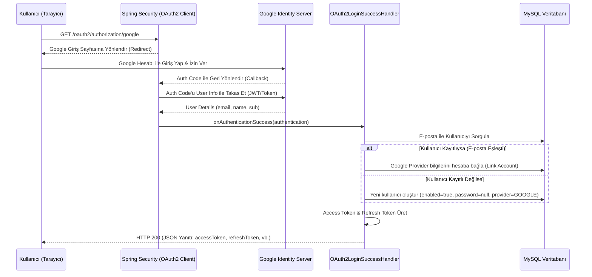

# 🛡️ Employee Management & Spring Security JWT API (oath2-google Branch)

Bu branch, projemize Google üzerinden **Sosyal Giriş (Google OAuth2 Social Login)** entegrasyonu ekler. Kullanıcıların geleneksel kullanıcı adı/şifre yöntemlerinin yanı sıra, Google hesaplarını kullanarak hızlı ve güvenli bir şekilde sisteme giriş yapmalarına olanak tanır.

Bu sürüm, projenin en gelişmiş sürümü olup; e-posta doğrulama, şifre sıfırlama, Email OTP 2FA ve Google Authenticator (TOTP) 2FA gibi önceki branch'lerdeki tüm güvenlik özelliklerini de içermektedir.

---

## 📌 Bu Branch'in Amacı ve Mantığı

Sosyal Giriş akışı, kullanıcı deneyimini artırırken hesap güvenliğini de üçüncü parti kimlik sağlayıcılarına (Identity Provider) devreder. Entegrasyonun çalışma mantığı şöyledir:

### 1. Giriş Başlatma (OAuth2 Initiation)
Kullanıcı tarayıcıdan `/oauth2/authorization/google` adresine yönlendiğinde, Spring Security OAuth2 istemcisi (client) devreye girer ve kullanıcıyı Google'ın giriş ekranına yönlendirir.

### 2. Başarılı Giriş Ele Alıcı (`OAuth2LoginSuccessHandler`)
Kullanıcı Google üzerinden başarıyla kimliğini doğruladıktan sonra sunucuya geri yönlendirilir. Sunucudaki `OAuth2LoginSuccessHandler` sınıfı tetiklenir:
1. **Veri Çıkarma**: Google'dan gelen kullanıcının e-posta adresi (`email`), benzersiz Google ID'si (`sub` - providerId) ve adı/soyadı (`name`) alınır.
2. **Hesap Eşleştirme (Account Linking)**:
   * Eğer kullanıcının e-posta adresi veritabanında zaten varsa, bu yerel hesaba Google bilgileri otomatik olarak bağlanır (`provider = GOOGLE` ve `providerId = sub` set edilir). Böylece kullanıcı gelecekte hem şifresiyle hem de Google ile aynı hesaba erişebilir.
3. **Otomatik Kayıt (Auto Registration)**:
   * E-posta adresi veritabanında kayıtlı değilse, kullanıcı için otomatik olarak yeni bir `Employee` kaydı oluşturulur.
   * Bu kaydın şifresi olmaz (`passwordHash = null`), e-posta Google tarafından doğrulandığı için `enabled = true` set edilir, rolü `USER` ve sağlayıcısı `GOOGLE` olarak kaydedilir.
4. **Token Üretimi ve Yanıt (JWT Delivery)**:
   * Başarılı eşleşme/kayıt sonrası sunucu, bu kullanıcı için bir JWT Access Token ve Refresh Token üretir.
   * **API-First Yaklaşım:** Sunucu, standart bir yönlendirme (redirect) yapmak yerine, üretilen token'ları doğrudan JSON formatında HTTP yanıt gövdesine (Response Body) yazar.

---

## 🛠️ Bu Branch'te Yapılanlar & Teknik Mimari

### 1. Yeni Eklenen ve Güncellenen Sınıflar
*   **`AuthProvider` (Enum)**: Kullanıcının sisteme hangi yöntemle dahil olduğunu belirtir: `LOCAL` (kullanıcı adı/şifre) veya `GOOGLE`.
*   **`OAuth2LoginSuccessHandler`**: Başarılı Google doğrulamasından sonra kullanıcıyı eşleştiren, kaydeden ve JWT üreterek JSON yanıtı dönen sınıftır.
*   **`Employee` Sınıfı Güncellemeleri**:
    *   `provider` (AuthProvider): Hesabın kayıt tipi (`LOCAL` veya `GOOGLE`).
    *   `providerId` (String): Google tarafındaki benzersiz kullanıcı kimliği (`sub` claim'i).
*   **`SecurityConfig` Entegrasyonu**:
    *   `.oauth2Login(...)` yapılandırması eklenmiş, başarılı girişte `OAuth2LoginSuccessHandler`'a yönlendirilmesi ve başarısızlık durumunda bir frontend callback URL'ine (örn. `http://localhost:3000/oauth-callback?error=...`) yönlendirilmesi sağlanmıştır.

### 2. Sosyal Giriş Akış Diyagramı (OAuth2 Flow)


---

## 🔑 Güncellenen Veritabanı Modeli

### Employee Tablosu (Eklenen Alanlar)
| Alan Adı | Tip | Açıklama |
| :--- | :--- | :--- |
| `provider` | Enum (AuthProvider) | `LOCAL` veya `GOOGLE` değerlerini alır |
| `providerId` | String | Google account ID'si (`sub`) |

---

## ⚙️ Kurulum ve Google Konsol Yapılandırması (`application.properties`)

Google Social Login özelliğini test etmek için [Google Cloud Console](https://console.cloud.google.com/) üzerinden bir OAuth 2.0 İstemci Kimliği (Client ID) oluşturmalı ve aşağıdaki yönlendirme URI'sini (Redirect URI) tanımlamalısınız:
*   `http://localhost:9094/login/oauth2/code/google`

Ardından elde ettiğiniz kimlik bilgilerini `application.properties` dosyasına eklemelisiniz:
```properties
# Google OAuth2 Settings
spring.security.oauth2.client.registration.google.client-id=YOUR_GOOGLE_CLIENT_ID
spring.security.oauth2.client.registration.google.client-secret=YOUR_GOOGLE_CLIENT_SECRET
spring.security.oauth2.client.registration.google.scope=email,profile
```
