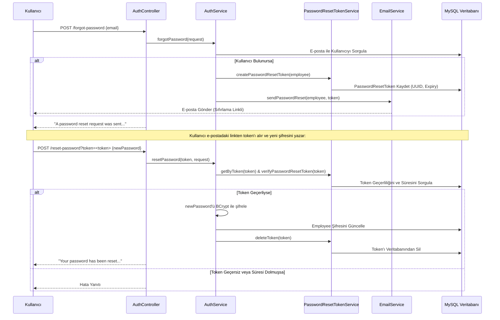

# 🛡️ Employee Management & Spring Security JWT API (password-reset-token Branch)

Bu branch, projemize güvenli bir **Şifre Sıfırlama (Password Reset)** akışı ekler. Kullanıcıların şifrelerini unutmaları durumunda, e-posta adreslerine gönderilen güvenli ve tek kullanımlık bir doğrulama token'ı aracılığıyla şifrelerini güncellemelerini sağlar.

Bu branch, bir önceki `email-verification` branch'indeki e-posta doğrulama yeteneklerini barındırır ve üzerine şifre sıfırlama mantığını inşa eder.

---

## 📌 Bu Branch'in Amacı ve Mantığı

Şifre sıfırlama süreci aşağıdaki adımlarla güvenli bir şekilde yürütülür:
1. **Şifre Sıfırlama Talebi**: Kullanıcı `/forgot-password` endpoint'ine kayıtlı e-posta adresini gönderir.
2. **Geçici Token Oluşturma**: Sistem, veritabanında e-postayı arar. Eğer bulunursa, benzersiz bir UUID tabanlı `PasswordResetToken` üretilir ve veritabanına kaydedilir.
3. **Sıfırlama Bağlantısının Gönderilmesi**: Kullanıcının e-posta adresine `http://localhost:9094/api/v1/auth/reset-password?token=<token>` biçiminde bir sıfırlama bağlantısı gönderilir.
4. **Şifre Değişimi**: Kullanıcı e-postadaki linkten aldığı token ve yeni şifresini (`ResetPasswordRequest`) `/reset-password` endpoint'ine gönderir. Yeni şifre yine `@Password` kurallarına uymak zorundadır.
5. **Güvenlik Doğrulaması**: Token veritabanından çekilir, süresi (expiryDate) ve geçerliliği kontrol edilir. Token geçerliyse kullanıcının şifresi BCrypt ile şifrelenerek güncellenir ve token veritabanından tamamen silinir (tek kullanımlık olması için).

---

## 🛠️ Bu Branch'te Yapılanlar & Teknik Mimari

### 1. Yeni Eklenen Sınıflar
*   **`PasswordResetToken` (Entity)**: Şifre sıfırlama taleplerini, ilgili kullanıcıyı ve token geçerlilik süresini (örn. 24 saat) veritabanında tutar.
*   **`PasswordResetTokenService`**: Token'ı oluşturan, veritabanına kaydeden, süresinin geçip geçmediğini doğrulayan ve işlem sonrası token'ı silen sınıftır.
*   **`ForgotPasswordRequest` (DTO)**: Kullanıcının şifresini sıfırlamak için girdiği e-postayı alan ve doğrulayan nesnedir.
*   **`ResetPasswordRequest` (DTO)**: Kullanıcının yeni şifresini barındırır. Yeni şifre, sistemdeki güçlü şifre kurallarını denetleyen `@Password` anotasyonu ile korunur.
*   **`PasswordResetTokenRepository`**: `password_reset_token` tablosu üzerinde CRUD operasyonları gerçekleştirir.

### 2. Şifre Sıfırlama Akış Diyagramı

---

## 🔑 Veritabanı Modeli

### PasswordResetToken Tablosu
| Alan Adı | Tip | Açıklama |
| :--- | :--- | :--- |
| `id` | Long (PK) | Otomatik artan benzersiz ID |
| `token` | String | Benzersiz UUID şifre sıfırlama token'ı |
| `employee_id` | Long (FK) | Token'ın ait olduğu çalışan (Employee) |
| `expiryDate` | Instant | Token'ın son geçerlilik tarihi |

---

## 🗺️ API Uç Noktaları (Endpoints)

*   **POST** `/api/v1/auth/forgot-password`
    *   **Açıklama:** Şifresini unutan kullanıcının e-posta adresini alır. Kullanıcı mevcutsa e-posta doğrulama token'ı gönderilir.
    *   **İstek Gövdesi:** `ForgotPasswordRequest` `{ "email": "ornek@domain.com" }`
*   **POST** `/api/v1/auth/reset-password?token={token}`
    *   **Açıklama:** Query parametresi olarak gelen token ile istek gövdesindeki yeni şifreyi doğrular ve şifre güncellemesini yapar.
    *   **İstek Gövdesi:** `ResetPasswordRequest` `{ "newPassword": "YeniSifre123!" }`
