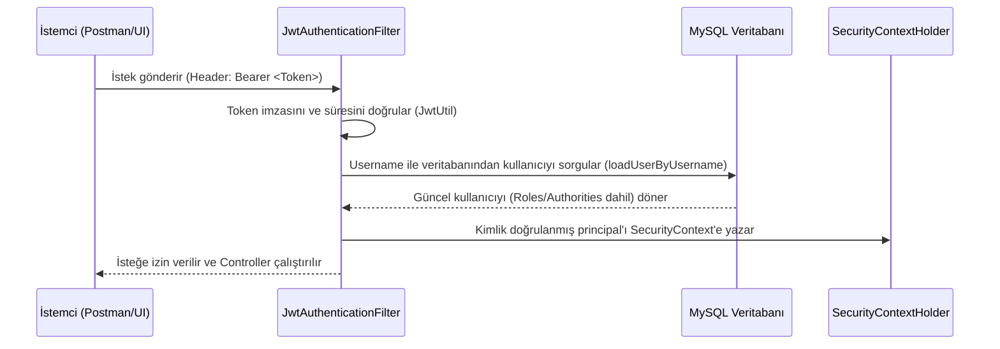

# 🛡️ Employee Management & Spring Security JWT API

Bu proje, **Spring Boot 3.x / 4.x** (Spring Boot 4.1.0-SNAPSHOT parent sürümü) ve **Spring Security 6.x** tabanlı, durumsuz (stateless) **JWT (JSON Web Token)** doğrulama mimarisine sahip gelişmiş bir Çalışan (Employee) Yönetim API'sidir. 

Proje kapsamında rol bazlı yetkilendirme (RBAC - Role-Based Access Control), veri doğrulama (Validation), özel şifre kısıtlamaları ve özelleştirilmiş güvenlik hata yakalayıcıları (Custom Exception Handling) gibi modern yazılım mimarisi bileşenleri uygulanmıştır.

---

## 🚀 Teknolojiler ve Bağımlılıklar

Proje aşağıdaki modern kütüphaneler ve teknolojilerle inşa edilmiştir:

*   **Java 17** (LTS)
*   **Spring Boot 4.1.0 (Parent Starter)**
*   **Spring Security 6.x** (Stateless, JWT entegrasyonlu)
*   **JJWT (Java JWT) 0.12.7** (Token oluşturma, imzalama ve doğrulama işlemleri için)
*   **Spring Data JPA & Hibernate** (Veri erişim katmanı)
*   **MySQL Connector J** (İlişkisel veritabanı sürücüsü)
*   **Spring Boot Starter Validation** (Giriş doğrulamaları)
*   **Lombok** (Kazan plakası/boilerplate kodların azaltılması amacıyla)

---

## 🔑 Güvenlik Mimarisi

Uygulama, oturum bilgilerini sunucuda tutmayan (session-less) tamamen **durumsuz (Stateless)** bir güvenlik modeli izler.

### Kimlik Doğrulama Akışı (Authentication Flow)



1.  **Güvenlik Öncelikli Yöntem (Mevcut Uygulama):** Filtre, gelen her istekte token'dan sadece `username` bilgisini çıkarır ve ardından `CustomUserDetailsService` üzerinden veritabanına giderek güncel rolleri/yetkileri sorgular. Bu yöntem sayesinde kullanıcının hesabı askıya alındığında, silindiğinde veya rolü değiştirildiğinde değişiklikler anında etki eder.
2.  **JWT Yapısı:** `JwtUtil.java` sınıfı, token oluşturulurken token gövdesine (claims) aşağıdaki bilgileri gömer:
    *   `subject` (Username)
    *   `email`
    *   `role` (USER, ADMIN)
    *   `employeeId`
3.  **Özel Hata Yakalayıcılar (Custom Security Handlers):**
    *   `JwtAuthenticationEntryPoint`: Kimlik doğrulaması olmadan korumalı bir kaynağa erişmeye çalışan isteklere `401 Unauthorized` hata şablonu döner.
    *   `JwtAccessDeniedHandler`: Giriş yapmış fakat yetkisi yetersiz olan (örneğin ADMIN sayfasına girmeye çalışan bir USER) kullanıcılara `403 Forbidden` hata şablonu döner.

---

## 🛠️ Veritabanı Modeli ve Validasyonlar

### Employee (Çalışan) Entitesi

Veritabanında saklanan çalışan bilgileri ve tipleri aşağıdaki gibidir:

| Alan Adı | Tip | Açıklama |
| :--- | :--- | :--- |
| `id` | Long (PK) | Otomatik artan benzersiz çalışan ID'si |
| `username` | String | Benzersiz kullanıcı adı |
| `passwordHash` | String | BCrypt ile şifrelenmiş parola |
| `firstName` | String | Çalışanın adı |
| `lastName` | String | Çalışanın soyadı |
| `tcNo` | String | Benzersiz T.C. Kimlik Numarası |
| `birthDate` | LocalDate | Doğum tarihi |
| `gender` | String | Cinsiyet |
| `phoneNumber` | String | Benzersiz telefon numarası |
| `email` | String | Benzersiz e-posta adresi |
| `address` | String | İkametgah adresi |
| `role` | Enum (Role) | `USER` veya `ADMIN` |

### 🔒 Özel Şifre Doğrulaması (`@Password`)

Sistemde şifre güvenliğini üst düzeye çıkarmak için `@Password` adında özel bir anotasyon ve `PasswordValidation` doğrulayıcısı tanımlanmıştır. Bu doğrulayıcı regex kullanarak şifrenin şu kurallara uymasını zorunlu kılar:
*   En az 8, en fazla 64 karakter uzunluğunda olmalıdır.
*   En az bir küçük harf içermelidir.
*   En az bir büyük harf içermelidir.
*   En az bir rakam içermelidir.
*   En az bir özel karakter (örn: `@, #, $, %, ^, &, +`) içermelidir.
*   Boşluk karakteri (` `) içermemelidir.

---

## 🗺️ API Uç Noktaları (Endpoints)

### 1. Kimlik Doğrulama Servisi (Auth Controller)
Tüm istekler `/api/v1/auth/**` altındadır ve bu uç noktalar herkese açıktır (`permitAll()`).

*   **POST** `/api/v1/auth/register`
    *   **Açıklama:** Yeni bir çalışan kaydı oluşturur. Varsayılan olarak `ROLE_USER` yetkisi atanır.
    *   **İstek Gövdesi (Request Body):** `EmployeeRegisterRequest` (username, password, tcNo, phoneNumber, email)
*   **POST** `/api/v1/auth/login`
    *   **Açıklama:** Kullanıcı bilgilerini doğrular ve geçerli bir JWT (Access Token) döndürür.
    *   **İstek Gövdesi (Request Body):** `EmployeeLoginRequest` (username, password)

### 2. Çalışan Yönetim Servisi (Employee Controller)
Tüm istekler `/api/v1/employees/**` altındadır ve isteklerin yetkilendirilmiş (authenticated) olması gerekir.

*   **GET** `/api/v1/employees/all`
    *   **Yetki:** Sadece `ADMIN` (`@PreAuthorize("hasRole('ADMIN')")`)
    *   **Açıklama:** Sistemdeki tüm çalışanların listesini döner.
*   **DELETE** `/api/v1/employees/{id}`
    *   **Yetki:** Sadece `ADMIN` (`@PreAuthorize("hasRole('ADMIN')")`)
    *   **Açıklama:** Belirtilen ID'ye sahip çalışanı sistemden siler.
*   **GET** `/api/v1/employees`
    *   **Yetki:** `ADMIN` veya `USER` (`@PreAuthorize("hasAnyRole('ADMIN','USER')")`)
    *   **Açıklama:** Giriş yapan çalışanın (kendi token'ından tespit edilen) detaylı profil bilgilerini döner.
*   **PUT** `/api/v1/employees`
    *   **Yetki:** Giriş yapmış tüm kullanıcılar.
    *   **Açıklama:** Giriş yapan çalışanın profil bilgilerini (isim, soyisim, adres, telefon, e-posta vb.) günceller.

---

## ⚙️ Kurulum ve Çalıştırma

### 1. Ön Gereksinimler
*   Java 17 (JDK) kurulu olmalı.
*   MySQL veritabanı sunucusu çalışır durumda olmalı ve `spring_security_db` adında bir şemaya sahip olmalı.

### 2. Yapılandırma (`application.properties`)
Veritabanı bağlantısı ve JWT ayarları için ortam değişkenlerinin (Environment Variables) tanımlanması gerekir.

Aşağıdaki değişkenleri sisteminizde veya IDE'nizde tanımlayabilirsiniz:
*   `USERNAME`: MySQL kullanıcı adınız.
*   `PASSWORD`: MySQL şifreniz.
*   `SECRET`: JWT'leri imzalamak için kullanılacak Base64 formatında kodlanmış gizli anahtarınız (Örn: en az 256-bit uzunluğunda güçlü bir hash).

### 3. Uygulamayı Çalıştırma
Projeyi derlemek ve çalıştırmak için proje kök dizininde aşağıdaki Maven komutlarını çalıştırın:

```bash
# Bağımlılıkları yükleyin ve derleyin
mvn clean install

# Uygulamayı çalıştırın (Varsayılan Port: 9094)
mvn spring-boot:run
```

---

## 🔍 Sık Karşılaşılan Sorunlar ve Çözümleri

### ❓ Rol Yetkisi Yetersiz Olduğunda Neden `403 Forbidden` Yerine `500 Internal Server Error` Dönen Hata Alıyorum?

**Sebep:** 
Eğer `@PreAuthorize("hasRole('ADMIN')")` ile korunan bir yere yetkisiz girdiğinizde `GlobalExceptionHandler.java` içindeki generic `@ExceptionHandler(Exception.class)` metodu, fırlatılan `AccessDeniedException` istisnasını yakalar. Bu nedenle hata Spring Security'nin filtre zincirine geri iletilemediği için `500 Internal Server Error` olarak döner ve `JwtAccessDeniedHandler` devreye girmez.

**Çözüm:**
`GlobalExceptionHandler.java` içerisine aşağıdaki istisna metodunu ekleyerek hatayı filtre zincirine geri fırlatabilirsiniz:

```java
import org.springframework.security.access.AccessDeniedException;

@ExceptionHandler(AccessDeniedException.class)
public void handleAccessDeniedException(AccessDeniedException ex) throws AccessDeniedException {
    throw ex; // Hatanın JwtAccessDeniedHandler tarafından 403 olarak işlenmesini sağlar.
}
```
