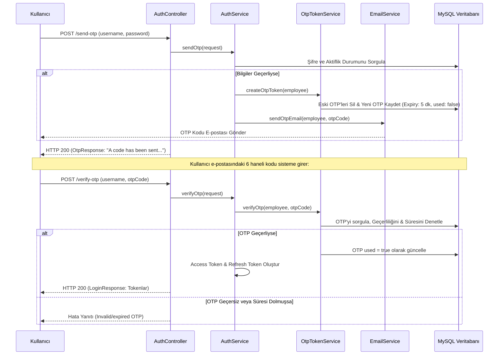

# 🛡️ Employee Management & Spring Security JWT API (2fa-email-otp Branch)

Bu branch, projemize e-posta üzerinden **İki Aşamalı Doğrulama (Two-Factor Authentication - 2FA Email OTP)** özelliğini ekler. Kullanıcıların sisteme giriş yapabilmek için şifrelerinin yanı sıra e-posta adreslerine gönderilen tek kullanımlık 6 haneli bir doğrulama kodunu (OTP - One Time Password) girmelerini zorunlu kılar.

Bu sürüm, önceki `email-verification` ve `password-reset-token` özelliklerini de bünyesinde barındırır.

---

## 📌 Bu Branch'in Amacı ve Mantığı

Geleneksel giriş yöntemlerinde şifrenin çalınması durumunda hesap güvenliği tehlikeye girer. Email OTP tabanlı 2FA akışında ise sisteme giriş yapmak 2 aşamalı hale getirilmiştir:

1. **1. Aşama: Şifre Doğrulama & OTP Gönderimi (`/send-otp`)**:
   Kullanıcı adı ve şifre kontrol edilir. Bilgiler doğruysa, `SecureRandom` ile 6 haneli rastgele bir sayı üretilir ve `otp_token` tablosuna kaydedilir (Varsayılan süre: 5 dakika). Ardından bu kod kullanıcının kayıtlı e-posta adresine gönderilir.
2. **2. Aşama: OTP Doğrulama & Giriş Tamamlama (`/verify-otp`)**:
   Kullanıcı e-postasına gelen 6 haneli kodu sisteme gönderir. Sistem, kodun doğruluğunu, süresini ve daha önce kullanılıp kullanılmadığını doğrular. Eğer kod geçerliyse JWT Access Token ve Refresh Token üretilerek kullanıcıya döner ve OTP kodu "kullanıldı (used = true)" olarak işaretlenir.

---

## 🛠️ Bu Branch'te Yapılanlar & Teknik Mimari

### 1. Yeni Eklenen Sınıflar ve Yapılar
*   **`OtpToken` (Entity)**: Üretilen OTP kodlarını, ilişkili çalışanı (Employee), kodun son geçerlilik zamanını ve kullanılıp kullanılmadığını (`used`) veritabanında tutar.
*   **`OtpTokenService`**: OTP kodu üretme (6 hane biçimli, güvenli SecureRandom ile), veritabanına kaydetme ve doğrulama süreçlerini yöneten servis sınıfıdır.
*   **`OtpTokenRepository`**: OTP verileri için CRUD işlemlerini yürütür ve kullanıcı bazlı eski/geçersiz OTP'leri temizler.
*   **`EmailOtpRequest` (DTO)**: OTP gönderim aşamasında kullanıcı adı ve şifre bilgilerini taşır.
*   **`VerifyOtpRequest` (DTO)**: OTP doğrulama aşamasında kullanıcı adı ve e-postaya gelen 6 haneli kodu taşır.
*   **`OtpResponse` (DTO)**: OTP kodunun e-postaya başarıyla gönderildiğini belirten yanıt nesnesidir.

### 2. İki Aşamalı Giriş Akışı (2FA Flow)

---

## 🔑 OTP Veritabanı Modeli

### OtpToken Tablosu
| Alan Adı | Tip | Açıklama |
| :--- | :--- | :--- |
| `id` | Long (PK) | Otomatik artan benzersiz ID |
| `employee_id` | Long (FK) | OTP kodunun ait olduğu çalışan |
| `otpCode` | String (6) | 6 haneli tek kullanımlık doğrulama kodu |
| `expiryDate` | Instant | Kodun son geçerlilik tarihi (Oluşturulduktan +5 dk sonra) |
| `used` | Boolean | Kodun kullanılıp kullanılmadığı bilgisi (Tek kullanımlık koruma) |

---

## 🗺️ API Uç Noktaları (Endpoints)

*   **POST** `/api/v1/auth/send-otp`
    *   **Açıklama:** Kullanıcı kimlik bilgilerini doğrular ve e-postaya tek kullanımlık kod gönderir.
    *   **İstek Gövdesi:** `EmailOtpRequest` `{ "username": "burak", "password": "Password123!" }`
*   **POST** `/api/v1/auth/verify-otp`
    *   **Açıklama:** E-postaya gelen OTP kodunu doğrular. Doğrulama başarılıysa JWT ve Refresh Token içeren ana giriş yanıtını döndürür.
    *   **İstek Gövdesi:** `VerifyOtpRequest` `{ "username": "burak", "otpCode": "123456" }`
