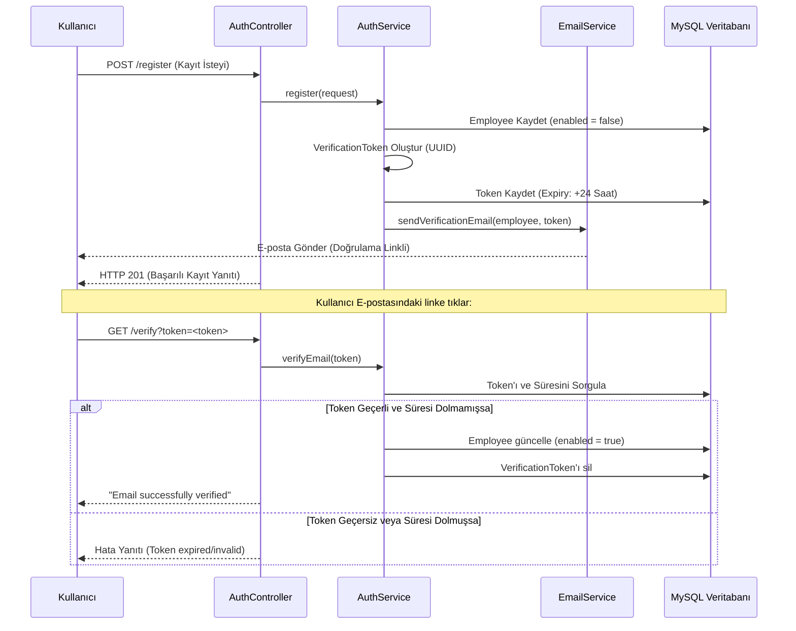

# 🛡️ Employee Management & Spring Security JWT API (email-verification Branch)

Bu branch, **Spring Security 6.x** ve **Spring Boot 3.x/4.x** tabanlı projemize, kullanıcıların sisteme giriş yapabilmeden önce e-posta adreslerini doğrulamalarını zorunlu kılan **E-posta Doğrulama (Email Verification)** mekanizmasını entegre eder.

---

## 📌 Bu Branch'in Amacı ve Mantığı

`email-verification` branch'inin temel amacı, sahte veya geçersiz e-posta adresleriyle kayıt yapılmasını önlemek ve hesap güvenliğini artırmaktır. Sistemin mantığı şu adımlardan oluşur:
1. **Kayıt Esnasında Pasif Hesap**: Kullanıcı kayıt olduğunda (`/register`), `Employee` tablosundaki `enabled` alanı varsayılan olarak `false` (pasif) olarak kaydedilir.
2. **Doğrulama Token'ı Üretimi**: Benzersiz bir UUID token (`VerificationToken`) oluşturulur, bu token ilgili çalışan (Employee) ile ilişkilendirilir ve veritabanına kaydedilir.
3. **E-posta Gönderimi**: Kullanıcının belirttiği e-posta adresine, içinde doğrulama token'ı barındıran bir bağlantı (link) gönderilir.
4. **Giriş Engeli**: E-posta doğrulaması tamamlanmamış (yani `enabled = false` olan) kullanıcılar sisteme giriş yapmaya çalıştıklarında kimlik doğrulama engellenir ve `EmailNotVerifiedException` fırlatılır.
5. **E-posta Aktivasyonu**: Kullanıcı e-postadaki linke tıkladığında token doğrulanır, ilgili kullanıcının `enabled` alanı `true` yapılır ve token veritabanından temizlenir.

---

## 🛠️ Bu Branch'te Yapılanlar & Teknik Mimari

### 1. Yeni Eklenen ve Güncellenen Sınıflar
*   **`VerificationToken` (Entity)**: E-posta doğrulama token'ını, oluşturulduğu çalışanı ve son geçerlilik süresini (`expiryDate`) tutan veritabanı tablosudur.
*   **`VerificationTokenService`**: Token'ı üreten, süresini kontrol eden ve doğrulayan ana iş mantığı sınıfıdır. Token geçerlilik süresi (varsayılan olarak 24 saat) yapılandırmadan okunur.
*   **`EmailService`**: `JavaMailSender` kullanarak şablon e-postayı hazırlar ve kullanıcıya gönderir.
*   **`EmailNotVerifiedException` (Exception)**: Doğrulanmamış kullanıcı girişlerinde fırlatılan özel bir çalışma zamanı istisnasıdır.
*   **`GlobalExceptionHandler`**: `EmailNotVerifiedException` hatasını yakalayarak istemciye anlamlı bir JSON hata formatı dönecek şekilde güncellenmiştir.
*   **`AuthService`**: 
    *   `register()` metoduna e-posta doğrulama akışı (token oluşturma ve mail gönderme) eklenmiştir.
    *   `login()` metodunda kullanıcının `enabled` durumu sorgulanıp doğrulanmamışsa giriş engellenmiştir.
    *   `verifyEmail(token)` adında yeni bir metot eklenerek, maile tıklayan kullanıcının aktif edilmesi sağlanmıştır.

### 2. Doğrulama Linki Akışı (Verification Flow)


---

## 🔑 E-posta Doğrulama Veritabanı Modeli

### VerificationToken Tablosu
| Alan Adı | Tip | Açıklama |
| :--- | :--- | :--- |
| `id` | Long (PK) | Otomatik artan benzersiz ID |
| `token` | String | Benzersiz UUID doğrulama token'ı |
| `employee_id` | Long (FK) | Token'ın ait olduğu çalışan (Employee) |
| `expiryDate` | Instant | Token'ın son kullanma zamanı (Expiration date) |

---

## 🗺️ API Uç Noktaları (Endpoints)

### Güncellenen ve Yeni Eklenen Uç Noktalar

*   **POST** `/api/v1/auth/register`
    *   **Değişiklik:** Artık kullanıcıyı pasif kaydeder ve e-posta doğrulama linki gönderir.
*   **POST** `/api/v1/auth/login`
    *   **Değişiklik:** E-posta doğrulanmamışsa `400 Bad Request` veya özel hata koduyla birlikte girişi engeller.
*   **GET** `/api/v1/auth/verify?token={token}`
    *   **Açıklama:** Yeni eklenen bu uç nokta, kullanıcının e-postadaki linke tıklamasıyla tetiklenir ve hesabı aktif eder.

---

## ⚙️ Kurulum ve E-posta Yapılandırması (`application.properties`)

E-posta gönderebilmek için SMTP sunucusu ayarlarının yapılması gerekir. Gerçek bir SMTP sunucusu (Gmail vb.) veya test için **Maildev / Mailhog** gibi yerel SMTP araçları kullanılabilir.

`application.properties` dosyasına eklenen değişkenler:
```properties
# Spring Mail Configuration
spring.mail.host=localhost
spring.mail.port=1025
spring.mail.username=test
spring.mail.password=test
spring.mail.properties.mail.smtp.auth=false
spring.mail.properties.mail.smtp.starttls.enable=false

# JWT & Verification Config
jwt.verification-expiration=86400000# 24 Saat (Milisaniye cinsinden)
```
> [!TIP]
> Eğer Gmail SMTP kullanacaksanız, `spring.mail.host=smtp.gmail.com`, port `587` veya `465` yapıp şifre alanına Gmail'den üreteceğiniz **Uygulama Şifresini (App Password)** yazmalısınız.
